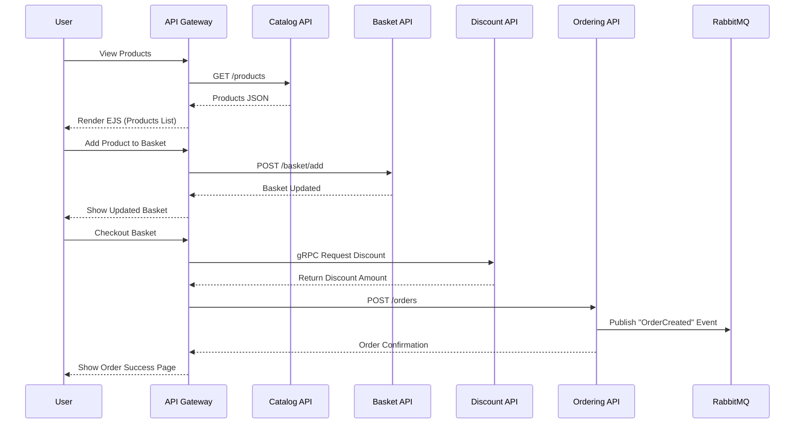

# ModuCart Request Workflow

```mermaid
sequenceDiagram
    participant U as User
    participant G as API Gateway
    participant C as Catalog API
    participant B as Basket API
    participant D as Discount API
    participant O as Ordering API
    participant MQ as RabbitMQ

    U->>G: View Products
    G->>C: GET /products
    C-->>G: Products JSON
    G-->>U: Render EJS (Products List)

    U->>G: Add Product to Basket
    G->>B: POST /basket/add
    B-->>G: Basket Updated
    G-->>U: Show Updated Basket

    U->>G: Checkout Basket
    G->>D: gRPC Request Discount
    D-->>G: Return Discount Amount

    G->>O: POST /orders
    O->>MQ: Publish "OrderCreated" Event
    O-->>G: Order Confirmation
    G-->>U: Show Order Success Page
```
